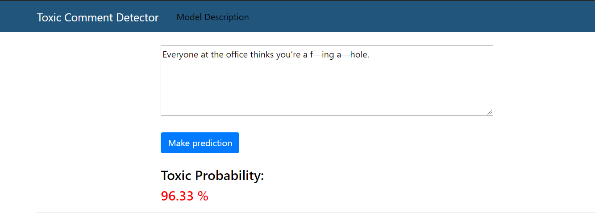

# Toxic-comment-detector-web-app

The aim of the project is to develop a web application that detects abusive comments. The project used Flask-API framework and Heroku cloud platform to deploy. Users are able to send a text to the model, via an API, and get back predictions on the web-server. I have used the Transformers library by Hugging Face and DistilBERT model to build a classifier on Pytorch deep learning library. 

You can find descriptions of the models and the project itself on the site. [LINK](https://toxic-comment-detector.herokuapp.com/) 

